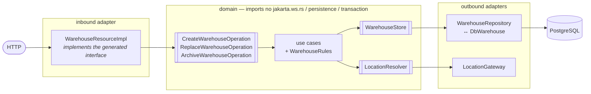
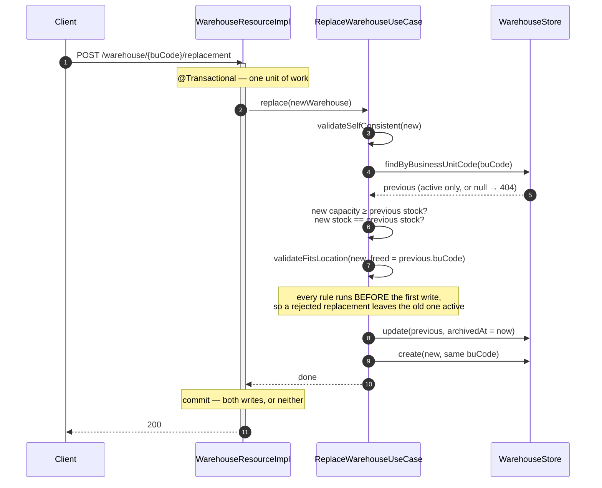
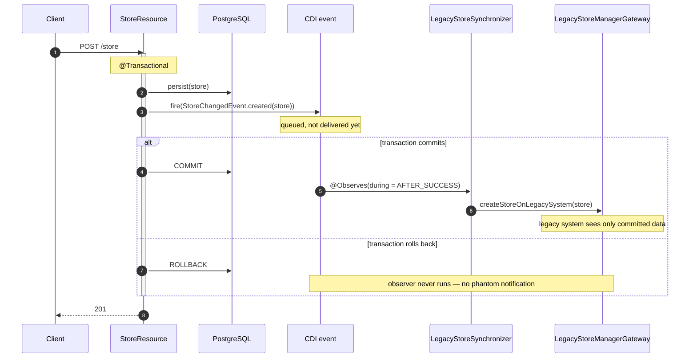

# CLAUDE.md

This file provides guidance to Claude Code (claude.ai/code) when working with code in this repository.

## What this repository is

An interview code assignment, not a production system. Two independent deliverables:

- `java-assignment/` — a Quarkus app with deliberately unimplemented methods to fill in. Tasks are in [CODE_ASSIGNMENT.md](java-assignment/CODE_ASSIGNMENT.md); three written questions live in [QUESTIONS.md](java-assignment/QUESTIONS.md) and are answered inline in that file's fenced blocks.
- `case-study/` — five discussion scenarios in [CASE_STUDY.md](case-study/CASE_STUDY.md), answered inline under each `[ fill here your answer ]` placeholder. No code.

Domain briefing (entities and the "replace" concept) is in [BRIEFING.md](case-study/BRIEFING.md). Note `java-assignment/CODE_ASSIGNMENT.md` links to `BRIEFING.md` as a sibling — the file actually lives in `case-study/`.

## Commands

All Maven commands run from `java-assignment/`. Requires JDK 17+.

```bash
./mvnw quarkus:dev
```

Dev mode with live reload; Quarkus Dev Services starts a throwaway PostgreSQL container automatically (Docker must be running). App at <http://localhost:8080/index.html>.

```bash
./mvnw package
```

Build. Also runs `quarkus:generate-code`, which regenerates the JAX-RS interfaces from the OpenAPI spec.

Unit/`@QuarkusTest` tests (Surefire, `*Test` classes):

```bash
./mvnw test
```

Single test class or method:

```bash
./mvnw test -Dtest=ProductEndpointTest
```

```bash
./mvnw test -Dtest=ProductEndpointTest#testCrudProduct
```

Run as a jar against a real PostgreSQL (the `%prod` profile in `application.properties` expects it on port 15432):

```bash
docker run -it --rm=true --name quarkus_test -e POSTGRES_USER=quarkus_test -e POSTGRES_PASSWORD=quarkus_test -e POSTGRES_DB=quarkus_test -p 15432:5432 postgres:13.3
```

```bash
java -jar ./target/quarkus-app/quarkus-run.jar
```

Integration tests (`*IT`, `@QuarkusIntegrationTest`) run against the **packaged jar** and are bound to `verify`, not `test`:

```bash
./mvnw verify
```

### Gotcha: `JAVA_HOME` must point at a JDK 17+

If `JAVA_HOME` points at a JRE 8, `./mvnw` dies before compiling anything with `GenerateCodeMojo has been compiled by a more recent version of the Java Runtime (class file version 55.0)`. Maven follows `JAVA_HOME`, not the `java` on `PATH`. The symptom is misleading — it looks like `com.warehouse.api.WarehouseResource` is missing, because code generation never ran.

```bash
export JAVA_HOME="/path/to/jdk-17"
```

### Gotcha: the Quarkus HTTP test port is fixed

`@QuarkusTest` binds port 8081, so two concurrent Maven runs collide with `QuarkusBindException: Port(s) already bound: 8081`. Pass a CLI override rather than editing `application.properties`:

```bash
./mvnw test -Dquarkus.http.test-port=0
```

### Gotcha: `import.sql` seeds shared, mutable state

Every `@QuarkusTest` shares the seeded rows, and `ProductEndpointTest` *deletes* product 1. New tests should use `@TestTransaction` or create their own data rather than mutating `MWH.001`/`TONSTAD`. Endpoint tests that go over HTTP cannot use `@TestTransaction` (the server commits in its own transaction) — those must clean up after themselves; see `FulfilmentEndpointTest`.

Note also that the seed itself violates a business rule: `MWH.001` sits in `ZWOLLE-001` with capacity 100 against a location maximum of 40. Validation applies to new writes only, so existing rows are grandfathered — don't use `ZWOLLE-001` as a capacity fixture. `TILBURG-001` is count-capped at 1 and already occupied, so it only exercises the count rule; use `AMSTERDAM-002` or `ZWOLLE-002` for capacity.

## Architecture

Three subpackages under `com.fulfilment.application.monolith`, each deliberately using a *different* persistence and API style. This variety is the point — question 1 and 2 in `QUESTIONS.md` ask you to critique it. Don't "harmonize" the styles unless a task asks for it.

| Area | Persistence style | API style |
|---|---|---|
| `stores` | Active Record — `Store extends PanacheEntity`, static `Store.findById(...)` called from the resource | Hand-written JAX-RS resource |
| `products` | Repository — `ProductRepository implements PanacheRepository<Product>` | Hand-written JAX-RS resource |
| `warehouses` | Hexagonal — domain model + ports, repository adapter maps to/from a separate `DbWarehouse` entity | Generated from OpenAPI spec |
| `fulfilment` | Repository + service — rules in `FulfilmentService`, persistence in `FulfilmentRepository` | Hand-written, with request/response records |

`fulfilment` is the one package added after the original skeleton. It associates warehouses as fulfilment units for products per store, capped at 2 warehouses per product per store, 3 warehouses per store, and 5 product types per warehouse. Each cap counts *distinct* participants and reusing one the store or warehouse already has does not consume a slot — without that exemption the second and third rules are mutually unsatisfiable. It references warehouses by business unit code, not row id, so an association survives a warehouse replacement.

### Warehouse: ports and adapters

This is the only area with a real layering discipline, and it's where most of the assignment lives.

- `warehouses/domain/models/` — plain POJOs (`Warehouse`, `Location`). No JPA annotations; the domain must stay persistence-free.
- `warehouses/domain/ports/` — interfaces: `WarehouseStore` (outbound persistence), `LocationResolver` (outbound location lookup), and the inbound operations `CreateWarehouseOperation` / `ReplaceWarehouseOperation` / `ArchiveWarehouseOperation`.
- `warehouses/domain/usecases/` — CDI beans implementing the inbound ports; this is where the business validations belong (business unit code uniqueness, location existence, max warehouses per location, capacity vs. location max capacity, stock fits capacity, and for replacement: new capacity accommodates old stock and stocks match).
- `warehouses/adapters/database/` — `DbWarehouse` (`@Entity`, table `warehouse`) plus `WarehouseRepository`, which implements both `WarehouseStore` and `PanacheRepository<DbWarehouse>` and converts between `DbWarehouse` and the domain `Warehouse`.
- `warehouses/adapters/restapi/WarehouseResourceImpl` — implements the *generated* interface and maps the domain `Warehouse` to the generated `com.warehouse.api.beans.Warehouse` bean.
- `location/LocationGateway` — `@ApplicationScoped`, implements `LocationResolver` against a hardcoded static list of locations (each with `maxNumberOfWarehouses` and `maxCapacity`).



The arrows only ever point **inwards**. That is the property the `jakarta.*` grep in *Working conventions* protects.

Archiving is a soft delete: `DbWarehouse.archivedAt` is set rather than the row being deleted. "Replace" means archive the existing warehouse holding a business unit code, then create a new one reusing that same code, preserving history.

The order of those two writes matters, and getting it backwards silently destroys the history the feature exists to preserve — `update()` resolves its row by business unit code among *active* rows, so creating first would make the update target the new generation:



### Generated OpenAPI code

`src/main/resources/openapi/warehouse-openapi.yaml` is the source of truth for the Warehouse HTTP API. `quarkus-openapi-generator-server` generates the `WarehouseResource` interface and `beans` into `target/generated-sources/...` under base package `com.warehouse.api` (configured in `application.properties`). Changing the API contract means editing the YAML and rebuilding — never hand-edit generated sources. In IntelliJ, if generated types aren't resolved, mark the generated `jaxrs` folder under `target/` as a generated sources root.

The spec's `/warehouse/{id}` path uses a generic `id` while the replacement path uses `businessUnitCode`, and the domain `Warehouse` model has no id field at all. **This project resolves `{id}` as the business unit code** for both GET and DELETE — domain-consistent, and the only identity the model actually carries. The spec's `"456"` example is misleading.

The generated bean also carries an `id` field with no domain counterpart, so it is always null in responses. That, the `{id}` ambiguity, and the spec's inability to express a 201 on create are three concrete examples of generated-spec versus domain drift.

### Transactions and the legacy gateway

`StoreResource` writes and the `LegacyStoreManagerGateway` call must not share a fate: notifying a downstream system about a change that later rolls back is worse than notifying it late. The resource fires a CDI event inside its transaction; `LegacyStoreSynchronizer` observes it at `AFTER_SUCCESS`, so the gateway is reached only once the commit has actually happened.



The event carries a detached snapshot of the **persisted** entity, not the request body, so the id is populated and the observer never touches a managed entity after the persistence context has closed.

### Data and schema

`quarkus.hibernate-orm.database.generation=drop-and-create` with `import.sql` seeding on every boot — the schema is regenerated from the entities, so there are no migrations to write, but changing an entity changes the table. Seed data: stores/products `TONSTAD`, `KALLAX`, `BESTÅ`; warehouses `MWH.001` (ZWOLLE-001), `MWH.012` (AMSTERDAM-001), `MWH.023` (TILBURG-001). Tests assert against these exact values, and `import.sql` must stay consistent with any column added to an entity.

## Working conventions

- The assignment's stubs are all implemented — no `UnsupportedOperationException` or `// TODO implement` remains in `src/main/java`. That grep is still the fastest way to check nothing has regressed.
- Business rules belong in `warehouses/domain/usecases/`, never in the resource or the repository. Test them with hand-written in-memory fakes for the ports — plain JUnit, no Quarkus boot, no mocking framework. The existing use-case tests run in well under a second for this reason; keep it that way.
- Both `ProductResource` and `StoreResource` declare their own nested `ErrorMapper implements ExceptionMapper<Exception>` `@Provider`. Two global mappers for the same exception type is a smell worth noting, and any new resource should not add a third — prefer mappers typed to a concrete domain exception, as `warehouses/adapters/restapi` and `fulfilment` do. A typed mapper takes precedence over the catch-alls.
- `ProductResource` and `StoreResource` expose their JPA entities directly as request and response bodies, so the schema *is* the wire contract. Don't copy that in new code; `fulfilment` uses request/response records instead.
- Code style is 2-space indent, google-java-format shape (as produced by the existing files). There is no formatter or linter plugin configured in `pom.xml` — nothing enforces this automatically.
- `pom.xml` sets `maven.compiler.release=17` while the compiler plugin still pins `source`/`target` to `11`. `release` wins, so Java 17 features compile fine (existing code already uses `var` and `Stream.toList()`); the stale `source`/`target` is leftover noise, not a real constraint. `<parameters>true</parameters>` is required for RESTEasy parameter binding — don't remove it.
